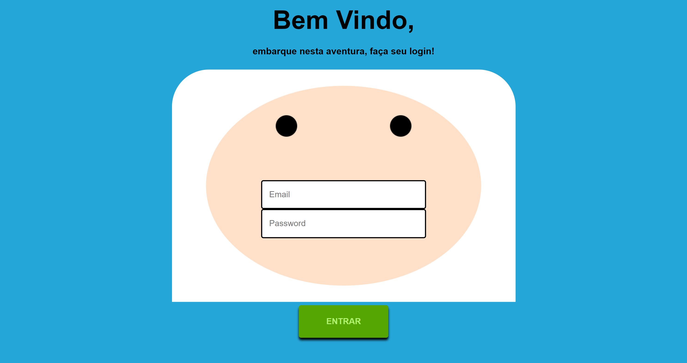

# 🗡️ Finn

Um formulário personalizado com a face do personagem "Finn", do desenho animado "Hora de Aventura".

## 📚 Tabela de Conteúdos

- [🗡️ Finn](#️-finn)
  - [📚 Tabela de Conteúdos](#-tabela-de-conteúdos)
  - [📋 Descrição](#-descrição)
    - [🚀 Funcionalidades](#-funcionalidades)
    - [🌐 Acesso](#-acesso)
    - [📸 Prévia](#-prévia)
  - [⚙️ Construção](#️-construção)
    - [💻 Tecnologias](#-tecnologias)
    - [🛠️ Ferramentas](#️-ferramentas)
    - [📌 Versão](#-versão)
  - [✏️ Aprendizado](#️-aprendizado)
  - [✒️ Autores](#️-autores)
  - [🎁 Agradecimentos](#-agradecimentos)
  - [📨 Contato](#-contato)

## 📋 Descrição

Este é um projeto de um formulário personalizado com a face do personagem "Finn", do desenho animado "Hora de Aventura".
Esse projeto foi disponibilizado na primeira aula prática de position do curso "Vai na Web" e tinha como proposta a utilização do position junto com todas as outras técnicas aprendidas para aplicar posicionamentos, espaçamentos e dimensões únicas. O modelo a ser seguido foi apresentado na plataforma de design "Figma".

### 🚀 Funcionalidades

As funcionalidades disponíveis para os usuários estão listadas abaixo:

- Utilizar um cursor especial do personagem "Finn"
- Redimensionar elementos ao redimensionar a página
- Preencher um formulário de envio
- Visualizar um site criativo do protagonista de "Hora de Aventura"

### 🌐 Acesso

🖇️ [Clique aqui para acessar o projeto](https://milton-salgado.github.io/finn/)

### 📸 Prévia

## ⚙️ Construção

Resumo geral dos recursos utilizados na construção do projeto.

### 💻 Tecnologias

Tecnologias utilizadas na construção do projeto:

### 🛠️ Ferramentas

Ferramentas utilizadas na construção do projeto:

### 📌 Versão

Utilizei o Git para o controle de versão. 

Versão atual: 1.0 (primeira versão)

## ✏️ Aprendizado

Ao fazer esse projeto, aprendi a:

- Utilizar a propriedade position com o valor "relative" em CSS
- Aplicar dimensões dinâmicas em todos os elementos da página
- Mesclar o conteúdo de flexbox com position em CSS
- Compreender e utilizar a tag "div" em casos específicos, mantendo a semântica da página

## ✒️ Autores

* **Milton Salgado Leandro** - *Todo o Projeto* - [GitHub](https://github.com/milton-salgado)

## 🎁 Agradecimentos

* Agradeço ao instrutor João Pedro Belo e aos facilitadores Merry Esperança e Naiara Souza pelo auxílio no meu processo de aprendizagem e apoio na construção do projeto.
* Agradeço também a você, visitante, por visualizar o meu projeto!

## 📨 Contato

